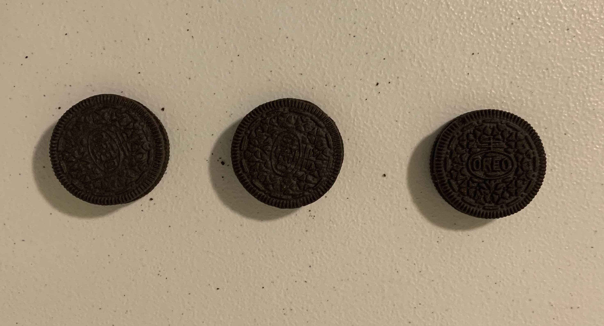
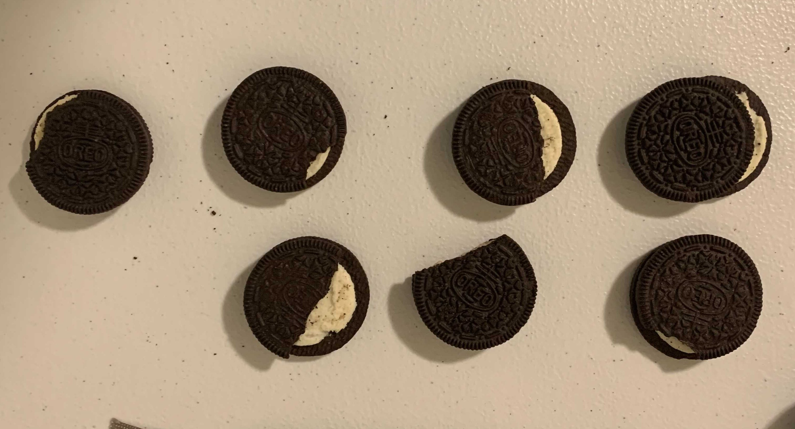
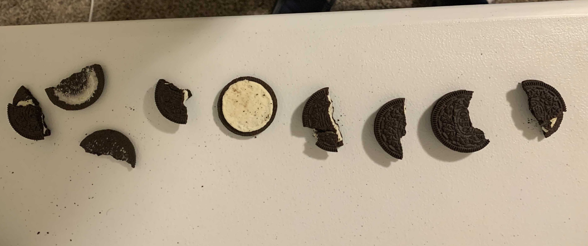

# Visual Inspection
Classify Oreos as good, bad or ugly using computer vision and deep learning. Done by Devon Webb and Easton Potokar. 

Found on github: https://github.com/contagon/VisualInspection.

## Idea Generation
We considered a bunch of different things to inspect including chips ahoys, pretzels, and a few other snacks. We landed on oreos due to the ease of defining what's good, bad and ugly, and because we like oreos :). We defined good, ugly and bad as follows:
| good | ugly | bad |
|:---:|:---:|:---:|
|  |  | |

Having taken a few deep learning courses, we decided we wanted to apply a convolutional neural network to solve this problem.

## Challenges
A tedious/difficult part was gathering enough data to train the network. This was done by recording videos of different oreos (as seen below) and using a small string, spinning them slightly to get all possible angles of them. We tried a few different ways of generating data, including moving the camera, but this absolutely worked the best. The code is in `gather_oreos.py`. Our dataset resulted in about 7,000 images in total, about 2,300 of each type.

The data can be found on box: https://byu.box.com/s/xzd5lf48uvfndyrhkowjfkglrmmyrldx

Training the network was also a bit difficult, it had a HUGE tendency to overtrain. When overtrained, even a slight change of lighting had a large effect in the classification. To combat this we lowered the learning rate, increased the batch size, and added a small weight regularization to prevent overfitting.

## Solutions
To locate the oreos, we simply took an image when beginning recording and set it as our "base". After that, for each image we did some slight blurring, differencing with the base, and thresholding to locate where changes or "oreos" in the image were. The code is in `run.py`.

To classify the oreos, we used a Convolutional Neural Network. It took in a 64x64 image with 3 channels and output 3 probabibilities of being good, bad or ugly. Training parameters can be found in `train.py`, as well as a few transforms before inputting images into the network.

## Results (on youtube)
Here's a video of lots of id-ing: https://youtu.be/clYLeb-u6Mo

Here's a video verifying it's done live: https://youtu.be/pyMjPFrHO-o